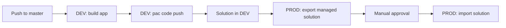

# CodeApps Repository

Template repository for Power Apps Code Apps (React + TypeScript) with Azure DevOps pipelines to build, deploy to DEV, and promote to PROD.

## Contents

- [pipeline-dev.yml](pipeline-dev.yml): DEV build and deploy pipeline for the code app.
- [pipeline-prod.yml](pipeline-prod.yml): Promotion pipeline that exports the solution, waits for approval, and imports it into PROD.

## How it works



1. **DEV pipeline** builds the app (`npm ci` + `npm run build`), authenticates with the Power Platform CLI (`pac`), and publishes it with `pac code push`. If `power.config.json` has no `appId`, the pipeline resolves or creates the app and commits the `appId` back to the repository.
2. **PROD pipeline** is run manually. It exports the managed solution from the source environment, waits for a manual approval, and imports it into PROD.

## Prerequisites

- Azure DevOps project with pipelines created from the YAML files above.
- Power Platform environments (DEV and PROD) with Dataverse.
- Service user with permissions to deploy code apps and import solutions in the target environments.
- Code app folder containing `package.json` and `power.config.json`.

## Azure DevOps Pipeline Variables

### DEV Pipeline ([pipeline-dev.yml](pipeline-dev.yml))

Required variables:

- CODEAPP_DIR: path to the code app folder (where `package.json` and `power.config.json` live).
- NODE_VERSION
- PAC_CLI_VERSION
- SERVICE_USERNAME
- TENANT_ID
- ENVIRONMENT_URL
- SERVICE_PASSWORD (secret)

Example values:

```text
CODEAPP_DIR=<code-app-folder>
NODE_VERSION=22.x
PAC_CLI_VERSION=2.8.1
SERVICE_USERNAME=service@powerplatform.top
TENANT_ID=<tenant-id>
ENVIRONMENT_URL=https://<org>.crm4.dynamics.com
SERVICE_PASSWORD=********
```

Notes:

- Set SERVICE_PASSWORD as secret in Azure DevOps.
- ENVIRONMENT_ID is not used by [pipeline-dev.yml](pipeline-dev.yml).
- The `trigger.paths` filter in [pipeline-dev.yml](pipeline-dev.yml) must point to your code app folder.

### PROD Pipeline ([pipeline-prod.yml](pipeline-prod.yml))

Required variables:

- SOLUTION_UNIQUE_NAME
- SOURCE_ENVIRONMENT_URL
- SOURCE_USERNAME
- SOURCE_TENANT_ID
- SOURCE_PASSWORD (secret)
- PROD_ENVIRONMENT_URL
- PROD_USERNAME
- PROD_PASSWORD (secret)
- TARGET_TENANT_ID (preferred) or PROD_TENANT_ID

Example values:

```text
SOLUTION_UNIQUE_NAME=<solution-unique-name>
SOURCE_ENVIRONMENT_URL=https://<source-org>.crm4.dynamics.com
SOURCE_USERNAME=service@powerplatform.top
SOURCE_TENANT_ID=<tenant-id>
SOURCE_PASSWORD=********
PROD_ENVIRONMENT_URL=https://<prod-org>.crm4.dynamics.com
PROD_USERNAME=service-prod@powerplatform.top
PROD_PASSWORD=********
TARGET_TENANT_ID=<tenant-id>
```

Pipeline behavior:

- Manual trigger only.
- Branch guard: runs only from `main`.
- Export managed solution from source.
- Manual approval gate before PROD import.
- Import managed solution into PROD.
